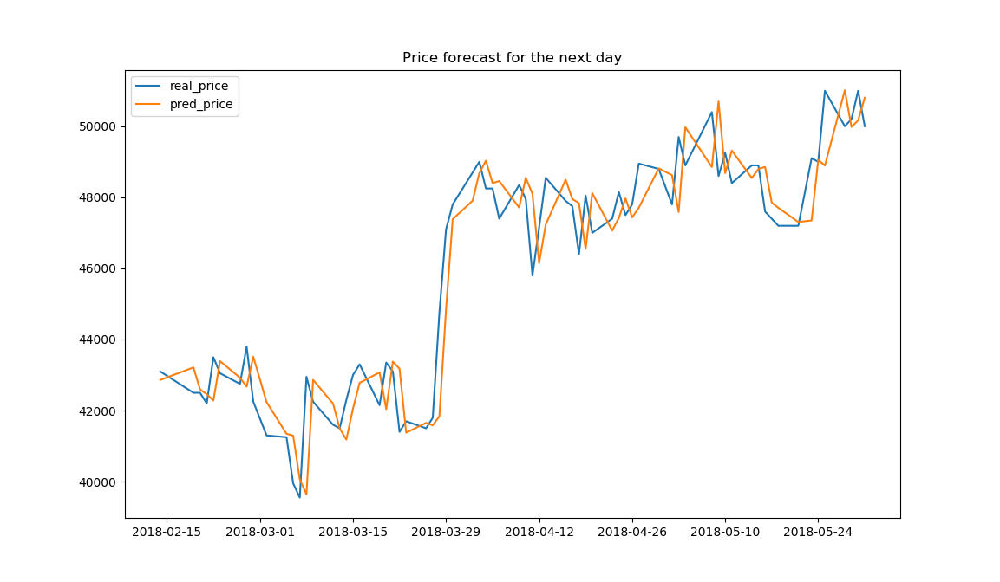
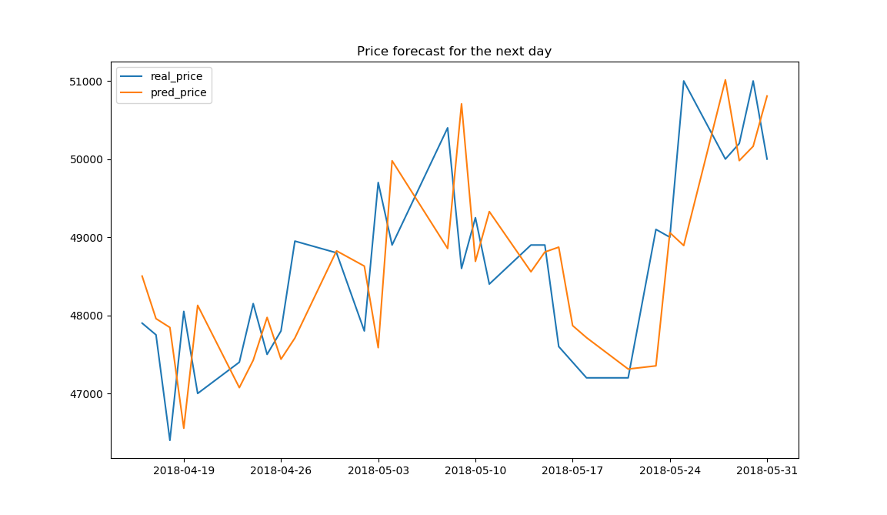

# Stock_price_forecasting

## image
    * architecture => 3종류의 딥러닝 아키텍처
    * error => 딥러닝 아키텍처별 학습 후의 종가 오차 분포 비교
        * 3가지 모델의 오차( (실제 종가 - 예측 종가 / 실제 종가) * 100 )의 분포는 비슷함 => 아무 모델이나 써도 됨
    * price_graph => 실제 종가와 예측 종가의 가격 그래프

## kospi200
    * kospi200 종목들의 종목 코드 및 회사명(2018-06-01 기준)

## 1. Download_kospi200_price_csv.py
    * kospi200 종목들의 주가 정보 수집. (2010-01-01 ~ )

    * input : kospi200/kospi200.csv
    * output : 1.download_stock_data
    

## 2. Add_stock_index.py
    * 수집한 kospi200 종목들에 sma14-21, ema14-21, BollingerBands, rsi14-21, macd, macd_signal 정보 추가.

    * input : 1.download_stock_data
    * output : 2.after_add_stock_index  
    

## 3. Data_preprocess.py
    * 데이터들을 날짜별로 20-gram으로 묶고 같은 의미를 갖는 column 단위로 데이터 정규화한 후 1row로 flatten.
    * 1row 정보 : 회사, 기준 날짜, 전처리 데이터, 기준 날짜의 종가, 기준 날짜부터 3일간의 종가/기준 날짜의 종가
        * 1 + 1 + (320=16*20) + 1 + 3 = 326 size.

    * input : 2.after_add_stock_index
    * output : 3.after_preprocess
    

## 4. Split_dataset.py    
    * 데이터를 학습, 검증, 테스트로 분할 : 0.7 : 0.15 : 0.15
        * 239,926 : 51,474 : 51,521

    * input : 3.after_preprocess
    * output : 4.split_dataset

## 5. Deep_learning
    * Bi_LSTM_average_encoder_output.py  
    * Bi_LSTM_luong_attention.py
    * Bi_LSTM.py
        * 딥러닝 코드 3개 결과가 전부 비슷함. 아무거나 사용해도 무방.
        * 윈도우는 코드 그대로 사용하면 됨
        * 리눅스에서는 pd.read_csv의 encoding='euc-kr' 지워야 실행됨.

    * preprocess_class.py
        * 1. ~ 3. 전처리 코드 합친 것. 필요에 맞게 수정해서 사용함. 아래 두 부분에서 사용됨.
            * 예측 가격 추론(딥러닝 코드의 inference 함수)
            * 실제 종가와 예측 종가의 가격 비교 그래프 생성(딥러닝 코드의 draw_test_graph 함수) 

    * 가격 추론 : 예측된 output * 기준 날짜의 종가 (3. Data_preprocess에서 3일간의 종가/기준 날짜의 종가를 해줬기 때문임)
    
    * 테스트셋을 이용한 예측 종가와 실제 종가의 평균 오차 (테스트 데이터)
        * 약 1.66%, 2.37%, 2.92% (각각 1일뒤, 2일뒤, 3일뒤)

## 실제 종가와 예측 종가의 가격 그래프

